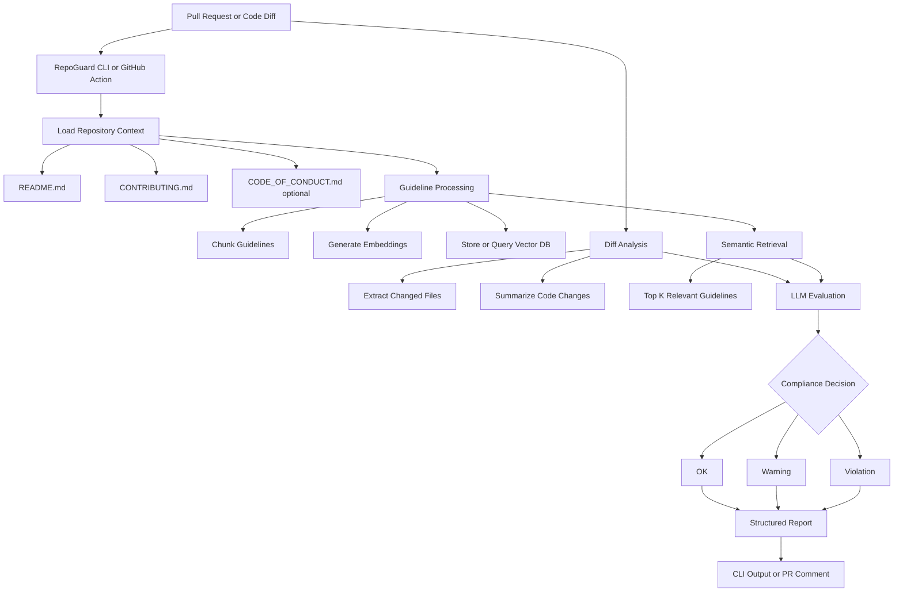

## Usage (3 commands)

### 1. Install

pip install repoguard-ai

### 2. Analyze repository guidelines (one-time or when docs change)

repoguard-ai analyze

### 3. Validate repository

repoguard-ai validate

# RepoGuard

RepoGuard is a **repo-aware pull request guideline validator**.

It evaluates code changes **only against a repository’s own written rules**
(README, CONTRIBUTING, optional CODE_OF_CONDUCT) and classifies the change as:

- **OK** – clearly complies with all applicable guidelines
- **Warning** – potentially violates a guideline (ambiguous or partial)
- **Violation** – clearly and unambiguously breaks a guideline

RepoGuard is **not**:

- a linter
- a CI replacement
- a code reviewer

It is a **pre-PR reasoning gate** focused on correctness, policy adherence, and trust.

---

## Why RepoGuard exists

Most automated checks enforce:

- syntax
- formatting
- generic best practices

But real engineering rules often live only in documentation:

- “Breaking changes must include migration notes”
- “Public APIs must be documented”
- “New endpoints require authentication”
- “Security-sensitive changes require justification”

RepoGuard enforces **what the repository itself declares**, not external opinions.

---

## How RepoGuard works

RepoGuard operates in **two explicit phases**:

1. **Analyze** – index the repository’s written guidelines
2. **Validate** – evaluate code diffs against those guidelines

This makes the system:

- deterministic
- explainable
- reusable across multiple validations

---

